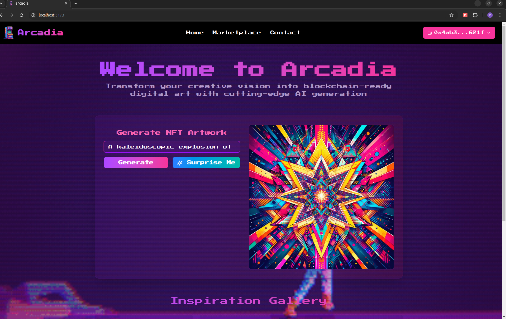

# Arcadia

Arcadia is an innovative NFT maker platform that empowers users to effortlessly create, customize, and surprise themselves with unique digital collectibles, blending creativity with blockchain technology. The platform is designed to transform the NFT creation process into an engaging, interactive, and creative journey.

[](assets/Demo.webm)

---

## Overview

Arcadia is a cutting-edge NFT maker designed to empower users to easily create and customize unique digital assets. With its intuitive interface, the platform makes NFT creation accessible to everyone, from seasoned Web3 enthusiasts to newcomers exploring the digital asset space. Whether you’re an artist, collector, or visionary, Arcadia offers a seamless way to transform ideas into valuable, blockchain-secured NFTs.

What sets Arcadia apart is its innovative surprise feature, which adds an exciting twist to the creation process. With this feature, users can generate unexpected, one-of-a-kind NFTs, introducing an element of thrill and discovery that keeps the experience engaging and fresh. This makes Arcadia not just a tool but an interactive platform where creativity meets the joy of unpredictability.

By blending ease of use with advanced functionality, Arcadia is perfect for creators looking to share their artistry, collectors building their digital portfolios, and anyone eager to explore the possibilities of blockchain technology.

---

## Key Features

1. NFT Creation and Customization
   - Easy-to-use tools for designing and customizing NFTs.  
   - Allows users to transform their ideas into blockchain-secured digital assets.

2. Surprise NFT Generation
   - Generate one-of-a-kind NFTs through a unique, surprise mechanism.  
   - Adds an element of thrill and creativity to the NFT-making process.

3. Interactive and Intuitive Interface
   - Accessible for both seasoned Web3 users and newcomers.  
   - Streamlined user experience with a focus on creativity and simplicity.

4. Blockchain Integration
   - Built on the Aptos blockchain for fast, secure, and efficient minting of NFTs.  
   - Ensures immutability and ownership verification for all created assets.

5. Educational Tool
   - Introduces users to the process of NFT creation and blockchain technology in a user-friendly manner.

---

## Technology Stack

- Frontend: React.js, TailwindCSS  
- Backend: Node.js, TypeScript  
- Blockchain: Aptos  
- Hosting: Vercel  
- Smart Contracts: Deployed using Aptos CLI  

---

## Website
[Visit Arcadia](https://arcadia-rqjs.vercel.app)

---

## Local Setup Instructions

### Frontend Setup
1. Navigate to the client directory:
```bash
cd client
```
2. Install dependencies:
```bash
npm install
```
3. Start the development server:
```bash
npm run dev
```

### Backend Setup
1. Navigate to the server directory:
```bash
cd server
```
2. Install dependencies:
```bash
npm install
```
3. Start the backend server:
```bash
node index.ts
```

### Smart Contract Deployment
1. Deploy the contracts using the Aptos CLI:
   Follow the [official Aptos CLI documentation](https://aptos.dev/en/build/cli) to set up and deploy the smart contracts.

---

## GitHub Repository
[Arcadia GitHub Repository](https://github.com/Karan-Palan/arcadia)

---

Arcadia is your gateway to the limitless potential of NFTs and Web3. Dive in and transform your creative visions into blockchain-powered reality!

